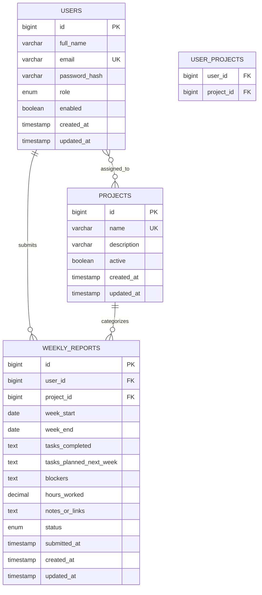

# Weekly Report Backend

Spring Boot REST API for the Weekly Report Generator & Team Dashboard assignment.

## Features

- JWT registration/login with BCrypt password hashing.
- Roles: `TEAM_MEMBER`, `MANAGER`, `ADMIN`.
- Team members can create, edit, submit, and view their own weekly reports.
- Managers/admins can view team reports with member/project/date filters.
- Managers/admins can manage projects/categories and assign projects to users.
- Dashboard metrics: submitted reports, compliance rate, open blockers, submission status, trend data, workload distribution, recent activity.
- Local rule-based assistant endpoint for summaries without sending report data to an external LLM.

## Requirements

- Java 17
- Maven wrapper included
- MySQL/MariaDB database named `weekly_report_db`

For XAMPP/MariaDB:

```sql
CREATE DATABASE weekly_report_db;
```

Database settings are in `src/main/resources/application.properties`.

## Run

```powershell
.\mvnw.cmd spring-boot:run
```

API runs at:

```text
http://localhost:8080
```

Seeded users:

```text
admin@example.com / Admin@123
member@example.com / Member@123
```

## Main API

Auth:

- `POST /api/auth/register`
- `POST /api/auth/login`

Use the returned token:

```text
Authorization: Bearer <accessToken>
```

Reports:

- `POST /api/reports`
- `PUT /api/reports/{reportId}`
- `POST /api/reports/{reportId}/submit`
- `GET /api/reports/mine`
- `GET /api/reports/team?memberId=&projectId=&from=&to=` manager/admin

Projects:

- `GET /api/projects`
- `POST /api/projects` manager/admin
- `PUT /api/projects/{projectId}` manager/admin
- `DELETE /api/projects/{projectId}` manager/admin

Users:

- `GET /api/users` manager/admin
- `PATCH /api/users/{userId}/role` admin
- `PATCH /api/users/{userId}/projects` manager/admin

Dashboard:

- `GET /api/dashboard?weekStart=2026-07-06&weekEnd=2026-07-12` manager/admin

Assistant:

- `GET /api/assistant/summary?weekStart=2026-07-06&weekEnd=2026-07-12` manager/admin
- `POST /api/assistant/ask` manager/admin

## ER Diagram



## Frontend Integration Notes

The frontend can keep separate pages for:

- Team member report form/history: `/api/reports` and `/api/reports/mine`
- Manager dashboard: `/api/dashboard`, `/api/reports/team`, `/api/users`, `/api/projects`

Allowed CORS origins are `http://localhost:3000` and `http://localhost:5173`.
